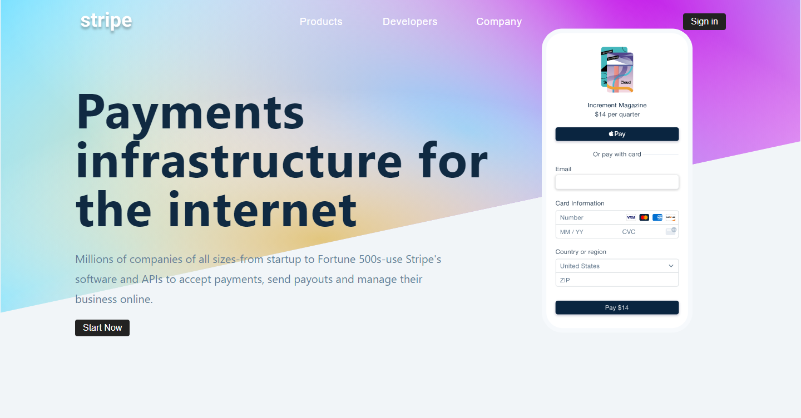

## React Project 8

<hr>

#### _**STRIPE SUBMENU**_

_CONTEXT API_ is used in this project.

To view in your local system, fork the project and install the dependencies using the below commands:

```shell
>> npm install
>> npm start
```

<br>
<p align="center">
  
</p>

<p align="center">
  
</p>
